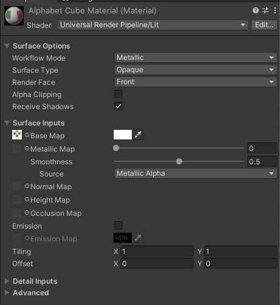
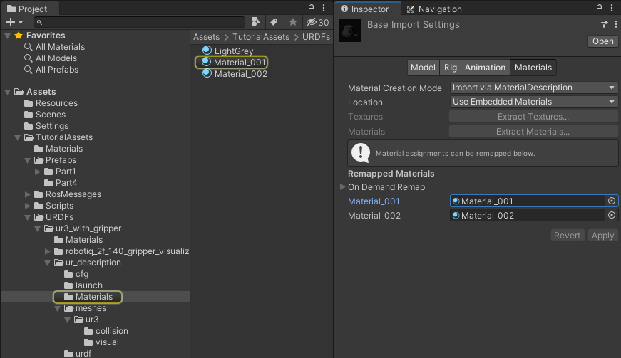

# Pose-Estimation-Demo Tutorial: Troubleshooting

**Table of Contents**
  - [Part 1: Create a Unity Scene with an Imported URDF](#part-1-create-unity-scene-with-imported-urdf)
    - [Package Installation](#package-installation)
    - [Assets, Materials](#assets-materials)
    - [URDF Importer](#urdf-importer)
  - [Part 3: Data Collection and model training](#part-3-data-collection-and-model-training)
    - [Docker, Environment](#docker-environment)
  - [Part 4: Pick-and-Place](#part-4-pick-and-place)
    - [Unity Scene](#unity-scene)
    - [Docker, ROS-TCP Connection](#docker-ros-tcp-connection)
    - [Ubuntu](#ubuntu)

## Part 1: Create a Unity Scene with an Imported URDF

### Package Installation
- If you are receiving a `[Package Manager Window] Unable to add package ... xcrun: error: invalid developer path...`, you may need to install the [Command Line Tools](https://developer.apple.com/library/archive/technotes/tn2339/_index.html) package for macOS via `xcode-select --install`.
  
### Assets, Materials
- Upon import, the cube and floor materials may appear to be bright pink (i.e. missing texture).
  - Cube: Go to `Assets/TutorialAssets/Materials`. Select the `AlphabetCubeMaterial`. There is a section called `Surface Inputs`. If the Base Map is not assigned, select the circle next to this field. Click on it and start typing `NonsymmetricCubeTexture` and select it when it appears. Apply this updated `AlphabetCubeMaterial` to the Cube. Your Inspector view should look like the following:
  
  - Floor: Assign the `NavyFloor` material to the Floor object.
- If all of the project materials appear to have missing textures, ensure you have created the project using the Universal Render Pipeline.
- If the UR3 arm's base has some missing textures (e.g. pink ovals), in the Project window, navigate to `Assets/TutorialAssets/URDFs/ur3_with_gripper/ur_description/meshes/ur3/visual >base.dae`. Select the base, and in the ***Inspector*** window, open the ***Materials*** tab. If the `Material_001` and `_002` fields are blank, assign them to `Assets/TutorialAssets/URDFs/ ur3_with_gripper/ur_description/Materials/Material_001` and `_002`, respectively. 
  
  

### URDF Importer
- If you are not seeing `Import Robot from URDF` in the `Assets` menu, check the ***Console*** for compile errors. The project must compile correctly before the editor tools become available. 
- If the robot appears loose/wiggly or is not moving with no console errors, ensure on the `Controller` script of the `ur3_with_gripper` that the `Stiffness` is **10000**, the `Damping` is **1000** and the `Force Limit` is **1000**. 
- Note that the world-space origin of the robot is defined in its URDF file. In this sample, we have assigned it to sit on top of the table, which is at `(0, 0.77, 0)` in Unity coordinates. Moving the robot from its root position in Unity will require a change to its URDF definition.	

    ```xml	
    <joint name="joint_world" type="fixed">	
        <parent link="world" />	
            <child link="base_link" />	
        <origin rpy="0.0 0.0 0.0" xyz="0.0 0.0 0.77"/>	
    </joint>	
    ```	

  **Note**: Going from Unity world space to ROS world space requires a conversion. Unity's `(x,y,z)` is equivalent to the ROS `(z,-x,y)` coordinate.

## Part 3: Data Collection and model training

### Docker, Environment
- If you are using a Docker container to train your model but it is killed shortly after starting, you may need to increase the memory allocated to Docker. In the Docker Dashboard, navigate to Settings (via the gear icon) > Resources. The suggested minimum memory is 4.00 GB, but you may need to modify this for your particular needs.
- If you encounter errors installing Pytorch via the instructed `pip3` command, try the following instead:
  ```bash 
  sudo pip3 install rospkg numpy jsonpickle scipy easydict torch==1.7.1 torchvision==0.8.2 torchaudio==0.7.2 -f https://download.pytorch.org/whl/torch_stable.html
  ```

## Part 4: Pick-and-Place

### Unity Scene
- The buttons might appear oversized compared to the rest of the objects in the scene view, this is a normal behavior. If you zoom out from the table you should see something similar to the following: 
<p align="center">

</p>

### Docker, ROS-TCP Connection
- Building the Docker image may throw an `Could not find a package configuration file provided by...` exception if one or more of the directories in ROS/ appears empty. This project uses Git Submodules to grab the ROS package dependencies. If you cloned the project and forgot to use `--recurse-submodules`, or if any submodule in this directory doesn't have content, you can run the `git submodule update --init --recursive` to grab the Git submodules. 
- `...failed because unknown error handler name 'rosmsg'` This is due to a bug in an outdated package version. Try running `sudo apt-get update && sudo apt-get upgrade` to upgrade packages.
- `Cannot connect to the Docker daemon at unix:///var/run/docker.sock. Is the docker daemon running?` The system-independent `docker info` command can verify whether or not Docker is running. This command will throw a `Server: ERROR` if the Docker daemon is not currently running, and will print the appropriate [system-wide information](https://docs.docker.com/engine/reference/commandline/info/) otherwise. 
- Occasionally, not having enough memory allocated to the Docker container can cause the `server_endpoint` to fail. This may cause unexpected behavior during the pick-and-place task, such as constantly predicting the same pose. If this occurs, check your Docker settings. You may need to increase the `Memory` to 8GB. 
  - This can be found in Docker Desktop settings, under the gear icon. 
- `Exception Raised: unpack requires a buffer of 4 bytes`: This may be caused by a mismatch in the expected Service Request formatting. Ensure that the [srv definition](../ROS/src/ur3_moveit/srv/MoverService.srv) matches the [generated C# script](../PoseEstimationDemoProject/Assets/TutorialAssets/RosMessages/Ur3Moveit/srv/MoverServiceRequest.cs), and that you have not modified these files since the last push to your ROS workspace.

### ROS Workspace
- If the `catkin_make` command is failing, ensure you are specifying which packages to build (i.e. `catkin_make -DCATKIN_WHITELIST_PACKAGES="moveit_msgs;ros_tcp_endpoint;ur3_moveit;robotiq_2f_140_gripper_visualization;ur_description;ur_gazebo"`). 
  - If the problem persists, add the `-j1` flag to the `catkin_make` command.

### Ubuntu
- Running Unity and Docker on Ubuntu may throw a `System.Net.SocketException: Address already in use` error when using the loopback address. If this is the case, in your Unity Editor, under ***Robotics > ROS Settings***, leave the `Override Unity IP Address` blank to let Unity automatically determine the address. Change the `ROS IP Address` to the IP of your Docker container, most likely `172.17.0.X`. You may need to modify these settings based on your unique network setup.